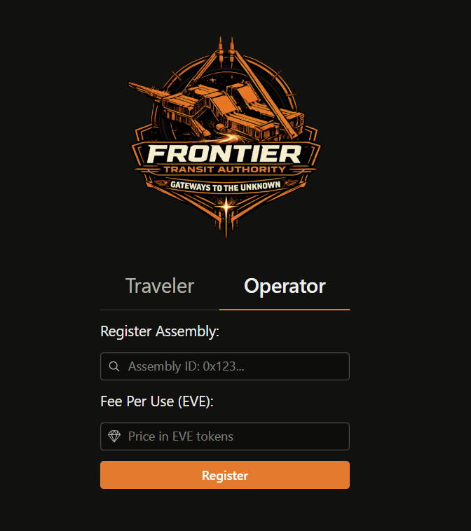

Operators register their infrastructure through the dApp in an external (out-of-game) browser, accessed at [https://internet.spaceship.enterprises/fta/](https://internet.spaceship.enterprises/fta/).

The dApp currently has minimal infrastructure for operators, lacking several features that we are currently working on. However, it is sufficient to register network nodes and gates with FTA for Hackathon demonstration purposes.

To register a network node or gate with the FTA, simply enter the assembly ID and the per-jump fee that you wish to charge (per-jump fee is the combination of the fees set on both the source and destination network nodes and gates).

Then click `Register`. Presently, you will not see a confirmation or error unless you view the console output in the browser's developer tools.

:::info

Some important points to note:
- A gate cannot be registered until its associated network node has already been registered.
- A gate cannot be registered unless it is linked to another gate.
- When a gate is registered, the linked gate is **also** registered.
- When a **network node** is registered, ownership remains with the operator (so they can continue to refuel it).
- When a **gate** is registered, ownership is transferred to the FTA shared object (so it can perform automated operations on the gate).

:::