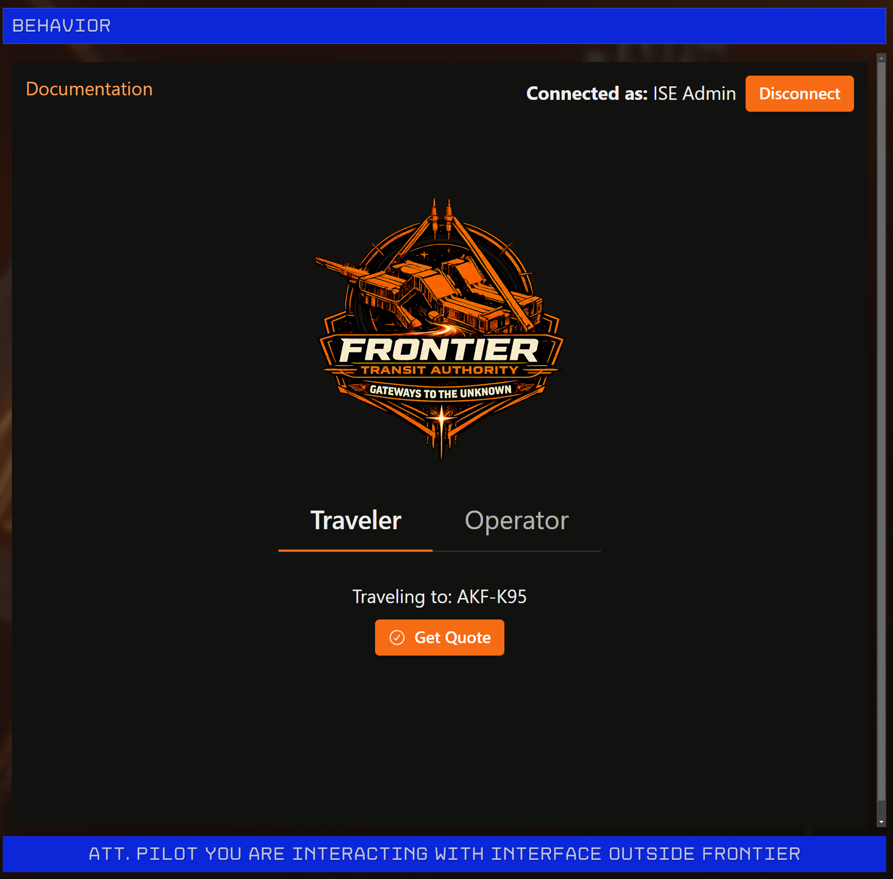
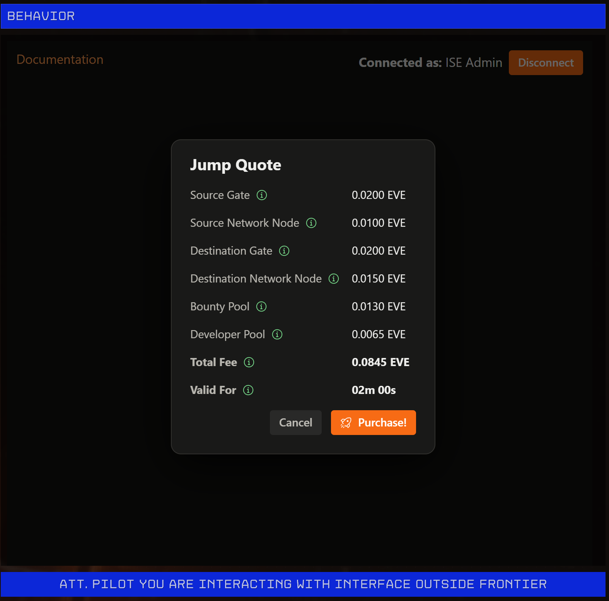
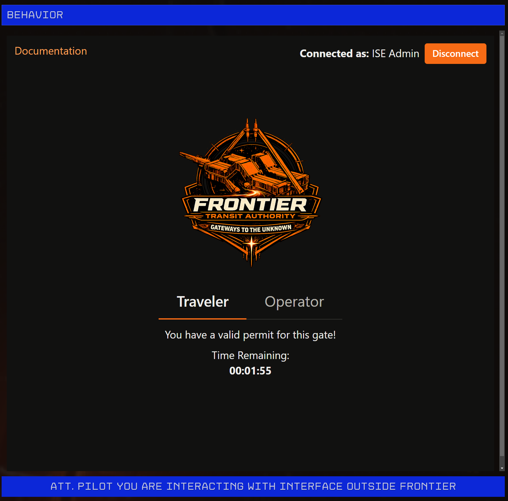

The benefits to players of using the FTA are obvious: instant access to a universe-wide transit network without needing to spend months grinding to build and maintain large-scale gate infrastructure. The pay-per-use model allows all players to use the FTA equally with no barrier to entry.

The intention of FTA and the design behind it is to make the network as player-friendly as possible, including:
- Easy purchase and use of jump permits
- Strong discouragement of aggressive behaviour near gates (gate camping)

Getting a jump permit as a traveler is quick and easy. Simply interact with the FTA gate you want to jump through, and you will see a friendly welcome screen.

Simply click the `Quote` button to get a quote for the jump. The quote is binding and is represented by a Sui object that gets transferred to the traveler, allowing them to later exchange that quote for a Jump Permit at a guaranteed price. The traveler will then see a breakdown of the pricing for a Jump Permit.

Note that the prices shown here are set by the operators of the source/destination gates/network nodes, not by FTA. If the traveler is satisfied with the price, they can click `Purchase!` to purchase the Jump Permit. They will then see a countdown showing how long the permit is still valid for.

The permit is good for one jump through that specific gate. If it expires, the traveler loses the ability to jump through the gate and will not be issued a refund.

:::warning

Presently, travelers must have some Sui tokens in their wallet to pay the gas fees for these transactions. We are currently working on providing sponsored transactions for obtaining Jump Quotes and Jump Permits.

:::