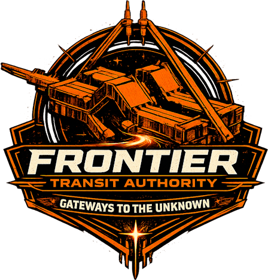

The Frontier Transit Authority (FTA) is a project to bring together the gate networks of all players and to create a functional interstellar transit system that incentivizes gate contributions and security.

### Concept

The overall concept is that we deploy a [shared object](./Design/Shared%20Ownership.md) with a strictly controlled Sui Move package that can only be updated [by player consensus](./Design/Upgrades.md). Players or tribes [build gates and network nodes](./Operators/index.md), link them, then register the network node with the FTA and transfer the gate ownership to the FTA shared object. When they do so, they specify a [base fee for using the gate](./Fee%20Structure/Gate%20Fee.md) (intended to recover the cost of building the gate) and a [base fee for using the network node](./Fee%20Structure/Network%20Node%20Fee.md) (intended to recover the cost of fuel to power the gate).

### Usage and Fees
The FTA then allows all other characters to [purchase jump permits](./Travelers/FTA%20Usage.md) for the gates and use them to jump. The [total fee](./Fee%20Structure/index.md) for a permit is the sum of:
1. The [base fee for the source gate](./Fee%20Structure/Gate%20Fee.md)
2. The [base fee for the source gate's network node](./Fee%20Structure/Network%20Node%20Fee.md)
3. The [base fee for the destination gate](./Fee%20Structure/Gate%20Fee.md)
4. The [base fee for the destination gate's network node](./Fee%20Structure/Network%20Node%20Fee.md)
5. A ["bounty" fee](./Fee%20Structure/Bounty%20Pool%20Fee.md) that funds FTA's defensive operations (a percentage of the base fee)
6. A ["developer" fee](./Fee%20Structure/Developer%20Fee.md) that goes to the developers to fund Sui gas costs for contract deployment and running regular update functions (a percentage of the base fee)

### Blackist / Penalty
This sum can then be scaled by a [blacklist penalty factor](./Penalties/Blacklist.md) to make jumps increasly expensive or prohibited entirely for characters who engage in aggressive behaviour against FTA infrastructure (Gates, Network Nodes, Turrets, etc.) _or_ who engage in aggressive behaviour with other players _near_ FTA infrastructure. This penalty system discourages both attacking FTA infrastructure, as well as "gate camping" in a manner that makes the FTA unsafe to use for other players.

### Bounties
The FTA has an integrated [Bounty System](./Penalties/Bounties.md) that offers rewards for retribution against characters who take aggressive actions towards the FTA. Bounties are funded by a [bounty fee](./Fee%20Structure/Bounty%20Pool%20Fee.md) that is applied to every jump permit. Bounties are automatically issued against any character who destroys an FTA asset (for which a Killmail is generated) and are automatically paid out to anyone who destroys a character for whom there is a bounty.

### Security and Confidence
No player will transfer their very expensive gates to FTA if they are not fully confident that there's no funny business going on. FTA addresses this concern by making all source code open-source and verifyable against on-chain package deployments, and by strictly controlling the [ability to upgrade or otherwise modify](./Design/Upgrades.md) the FTA package.

The FTA makes use of Sui [custom upgrade policies](https://docs.sui.io/guides/developer/packages/custom-policies) to prevent the developers from freely publishing package updates, which would pose a security risk and allow the developers to "steal" all of the gates and funds. In this restricted model, holding the `UpgradeCap` allows only two actions:
1. Withdrawing from the ["developer fee"](./Fee%20Structure/Developer%20Fee.md) balance.
2. Proposing new package upgrades for the community to vote on (upgrades can only be authorized by majority vote).

Note that having the `UpgradeCap` *does not* permit upgrading the existing package or calling any extra functions that would modify FTA behaviour. There is no way for the developer or any other party to transfer Gates or other assets out of the FTA shared object.

### Progress

We have focused heavily on the Sui Move package for this project and it is in good shape for heavy testing. The dApp user interface is functional but minimal, as we decided early on to focus on deep technical capability of the underlying contract instead of a pretty UI.

For Hackathon evaluation purposes, we respectfully request that community members and judges evaluate the project based on the technical merit of the Sui contracts, and not on the UI.